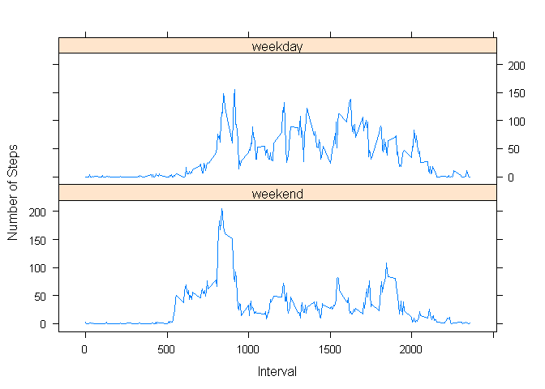

# Reproducible Research: Peer Assessment 1


## Loading and preprocessing the data

```r
unzip("./repdata_data_activity.zip")
activityData<-read.csv("./activity.csv", colClasses=c("integer","Date","integer"))
```

## What is mean total number of steps taken per day?

```r
library(dplyr)
```

```
## 
## Attaching package: 'dplyr'
## 
## The following object is masked from 'package:stats':
## 
##     filter
## 
## The following objects are masked from 'package:base':
## 
##     intersect, setdiff, setequal, union
```

```r
activityDataGrouped<-group_by(activityData, date)
activityDataPerDay<-summarize(activityDataGrouped, total_steps=sum(steps, na.rm=TRUE))

barplot(activityDataPerDay$total_steps, names.arg=activityDataPerDay$date, main="The Total Number of Steps Taken Each Day", xlab="Date", ylab="Number of Steps")
```

 

```r
mean_ttl_steps<-mean(activityDataPerDay$total_steps, na.rm=TRUE)
median_ttl_steps<-median(activityDataPerDay$total_steps, na.rm=TRUE)
```
The mean of the total number of steps: 9354.2295082.
The median of the total number of steps: 10395.


## What is the average daily activity pattern?

```r
activityDataGrouped<-group_by(activityData, interval)
activityDataPerInterval<-summarize(activityDataGrouped, avg_daily_steps=mean(steps, na.rm=TRUE))

plot(activityDataPerInterval$interval, activityDataPerInterval$avg_daily_steps, type="l", main="The Average Daily Activity Pattern", xlab="Interval", ylab="Number of Steps")
```

 

```r
max_avg_daily_steps<-max(activityDataPerInterval$avg_daily_steps)
interval_with_max_avg_daily_steps<-sprintf("%04d", as.integer(activityDataPerInterval[(activityDataPerInterval$avg_daily_steps==max_avg_daily_steps), "interval"]))
```
The 5-min interval, 0835, contains the maximum number of steps on average across all the days in the dataset.

## Imputing missing values

```r
ttl_na<-nrow(activityData[(activityData$steps==NA),])
```
The total number of missing values in the dataset is 17568.  
Using median values for each interval as the strategy for imputing missing data.

```r
library(data.table)
```

```
## 
## Attaching package: 'data.table'
## 
## The following objects are masked from 'package:dplyr':
## 
##     between, last
```

```r
DT<-data.table(activityData)
DT<-DT[, filling_value:=median(steps, na.rm=TRUE), by=interval]
DT<-DT[is.na(steps),steps:=filling_value]
activityDataImputed<-select(DT, -(filling_value))
activityDataGrouped<-group_by(activityDataImputed, date)
activityDataPerDay<-summarize(activityDataGrouped, total_steps=sum(steps, na.rm=TRUE))

barplot(activityDataPerDay$total_steps, names.arg=activityDataPerDay$date, main="The Total Number of Steps Taken Each Day", xlab="Date", ylab="Number of Steps")
```

 

```r
mean_ttl_steps<-mean(activityDataPerDay$total_steps, na.rm=TRUE)
median_ttl_steps<-median(activityDataPerDay$total_steps, na.rm=TRUE)
```
The mean of the total number of steps: 9503.8688525.
The median of the total number of steps: 10395.  
These values slightly differ from the estimates from the first part of the assignment.  
The impact of imputing missing data on the estimates of the total daily number of steps is increasing days with measurable values other than zero.

## Are there differences in activity patterns between weekdays and weekends?

```r
activityDataImputed<-mutate(activityDataImputed, day_type=factor(weekdays(date) %in% c("星期六", "星期日"), labels=c("weekend", "weekday")))
activityDataGrouped<-group_by(activityDataImputed, day_type, interval)
activityDataByWeekdayTypeAndInterval<-summarize(activityDataGrouped, avg_daily_steps=mean(steps))

library(lattice)
xyplot(avg_daily_steps~interval|day_type, data=activityDataByWeekdayTypeAndInterval, layout=c(1,2), xlab="Interval", ylab="Number of Steps", type="l")
```

 
